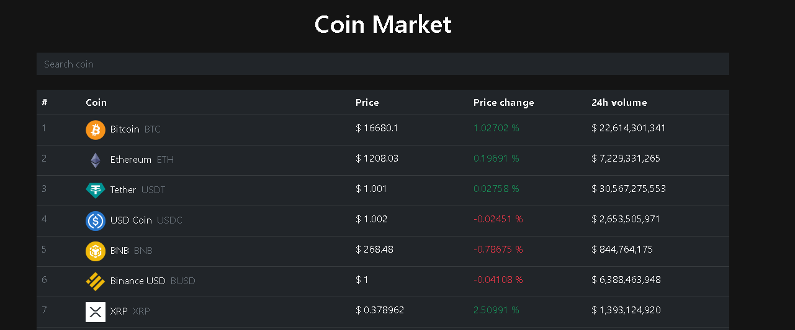

# Practica de Vue
Este ejemplo fue desarrollador siguiendo el video tutorial del Fazt Code
[Enlace al video](https://www.youtube.com/watch?v=4QcNMuQTkqs)

Este es el enlace a pagina de la API publica COINGECKO
[CoinGecko](https://www.coingecko.com/es)

### Resultado

